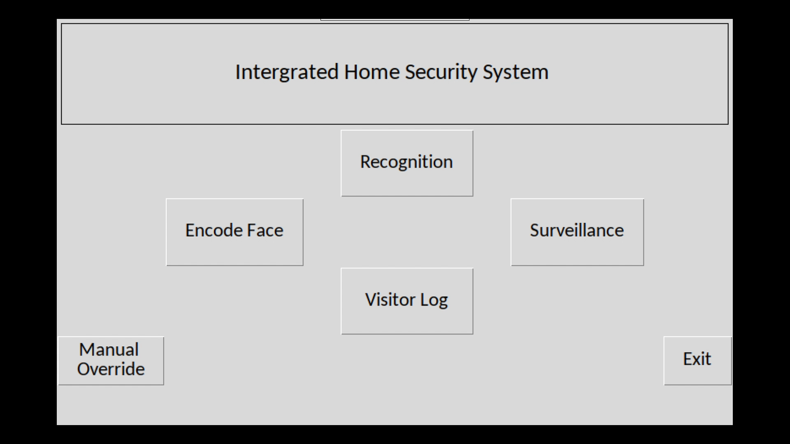

Developed as a SSN Innovation Centre funded research project, I-Nethra is aimed at bringing quality Home Surveillance at low costs to make it more accesible to the masses. The IoT based Home Security System uses Face Recognition for biometric authorization and is deployed on a Raspberry Pi. An electromagnetic lock controlled through a relay setup by the Raspberry Pi is used for locking and unlocking the door. A Raspberry Pi Camera V2 is used as the main camera module paired with a LCD display for interacting with people at the door. ​

The Face Detection is performed using a HOG based detector where the image is converted into a format which removes the effect of different lighting conditions and backgrounds from identifying faces. Instead, the flow of light from low to high intensity is captured here which allows us to detect the locations of facial features. The recognition aspect is handled by a ResNet Model with 29 conv layers. Each image is stored as a 128 dimensional vector and each predicted sample is mapped to its appropriate image class using a KNN Classifier.

For entering the building, the resident just needs to come close and stand in front of the camera. The resident's face is recognized and the door is automatically opened for a duration of 10 secs for them to enter. After 10 secs, the door automatically locks itself and the entry of the resident is logged. Options are provided for multi face recognition in case of multiple residents entering at the same time. Also, ability to allow new people to enter the building temporarily based on the resident's permission is provided. Every entrant's face, time of entry and failed attempts are logged to help in tracing culprits attempting unauthorized access. 

Administrators of the building are also provided with the ability to add new faces to the library without any additional tools. The application's UI guides admins in registering new faces right from automatically taking multiple images of the registrant and retraining the model for identifying the new individual. Additionally, a custom motion detection algorithm has been implemented to enable the system to work on standby mode until a person approaches and to enable liveliness detection, ensuring greater security against intrusion attacks.

## Libraries Used
* dlib
* OpenCV
* Picamera
* RPi.GPIO

