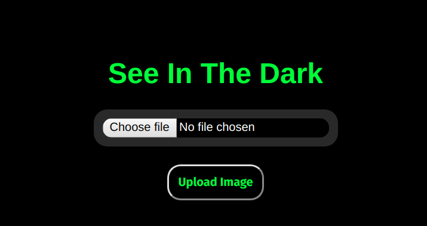

This project focuses on Low Light Photo Enhancement Using Simplified Fully Convolutional Neural Networks. This was attempted to produce a memory efficient model that can effectively run on edge devices and deliver an optimum level of image enhancement and noise reduction. 

The Neural Network model architecture is written in PyTorch and the application is deployed using Flask. The model was trained on the [Sony_gt Dataset](https://drive.google.com/drive/folders/1vlUte4X_qKUtm-D61eXuoJGSl2crsOCc?usp=sharing) which is a subset of the Sony dataset containing images of varying exposures. 

The model implemented in this project is an adaptation from the paper "Chen Chen, Qifeng Chen, Jia Xu, and Vladlen Koltun, "Learning to See in the Dark", in CVPR, 2018." We were able to reduce the number of layers and retrain the model in such a way the RAM overhead of the model was reduced while having an acceptable trade-off in terms of accuracy. Model Inference times were also significantly reduced.

This project was done as a part of The MLH Local Hack Day 2019.
## Packages Used
- PyTorch
- Flask
- requests
- numpy

To check out the source code in Github, click [here](https://github.com/aashish2000/SeeInDark).
