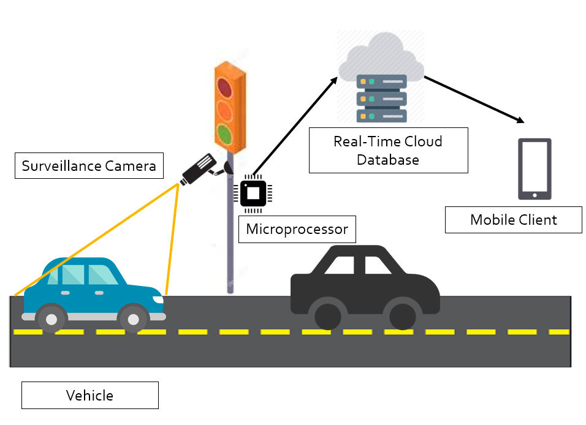

This project is aimed at detecting traffic violations as they happen and notifying the appropriate authorities automatically. The violations are detected from a real time surveillance camera feed. When a violation is identified, the numberplate of the violating vehicle is captured and the violation details such as location, time and numberplate of violator's vehicle is sent to a real-time Firebase Database. A mobile app is also developed to provide notifications to the officials in charge to take appropriate action. Provision has been provided to send emails to the violator's email ID with the fine details to be paid.

The traffic violations handled by this project are Overspeeding and Red Light Violation. The numberplate recognition is performed by modifying and fine tuning the open source implementation of OpenALPR to work better on Indian Numberplates. This project was presented to the ACP Traffic Police, Greater Chennai Traffic Corporation for further development and collaboration. The project was originally developed as a part of The Smart India Hackathon 2020 Edition for the problem statement provided by The Department of Science and Technology.

## Packages Used
- Dlib
- OpenCV
- Pyrebase

To check out the source code in Github, click [here](https://github.com/aashish2000/Traffic-Violation-Detection).
